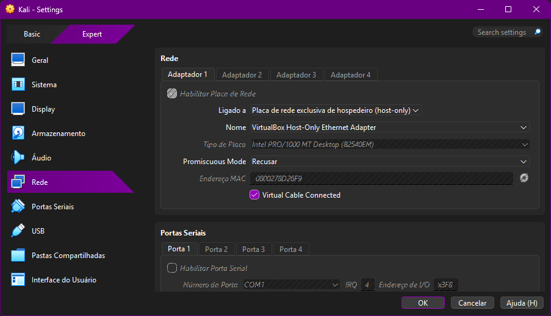
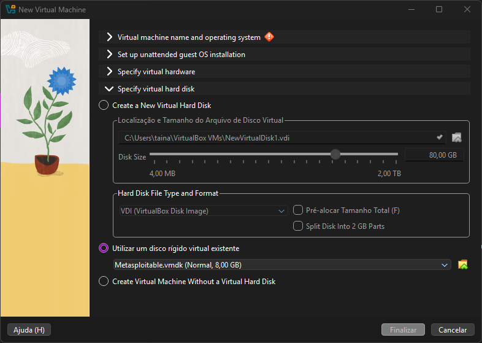
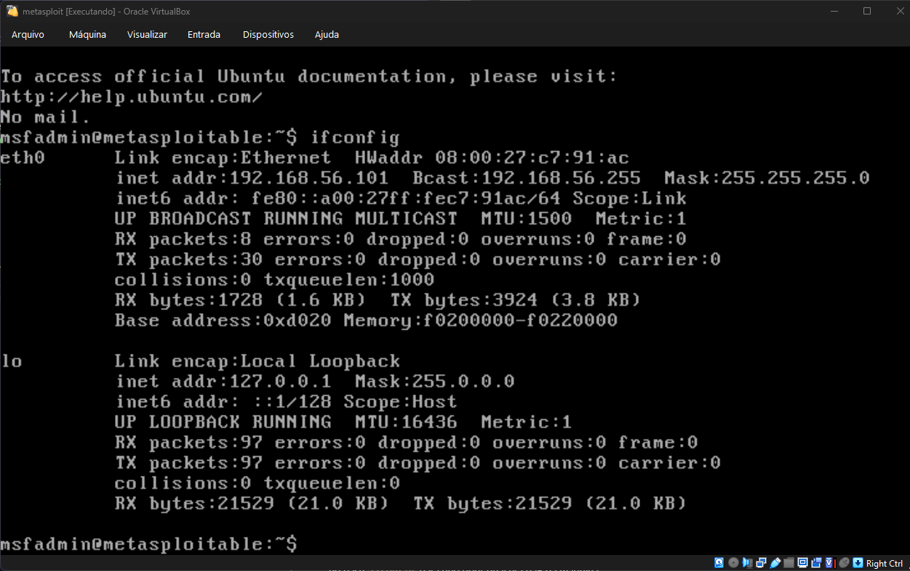
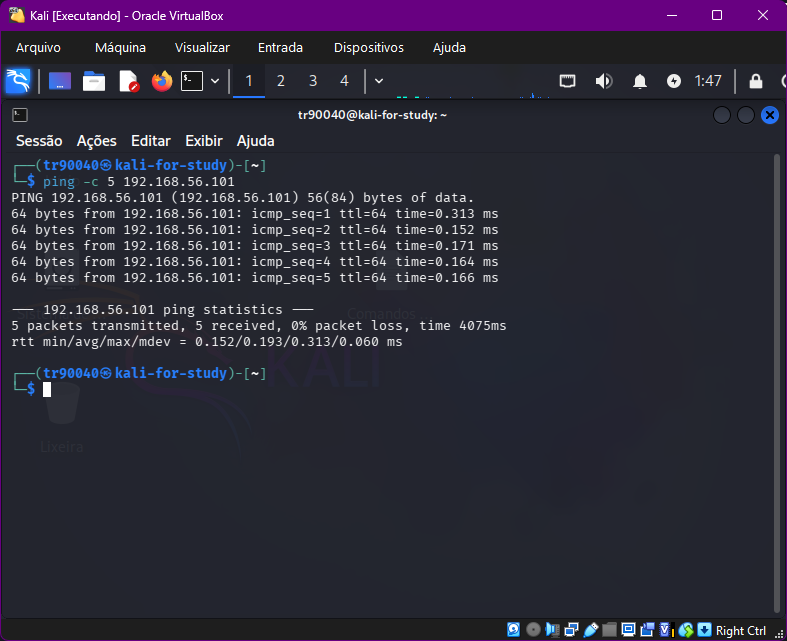
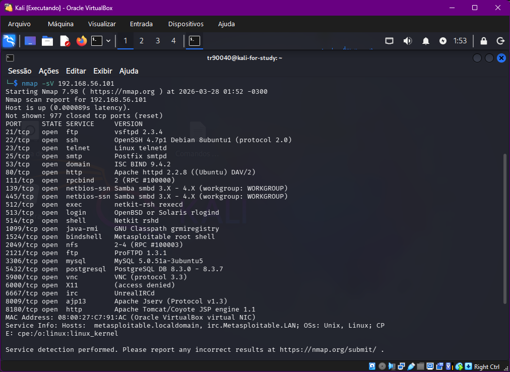
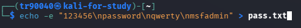
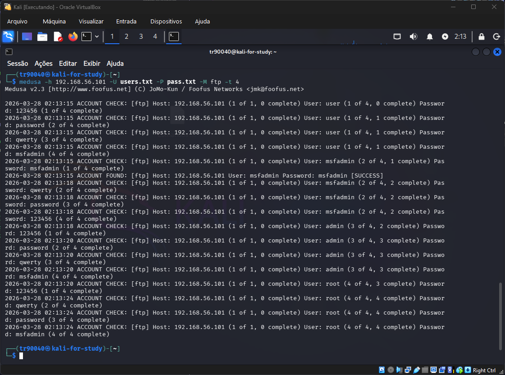
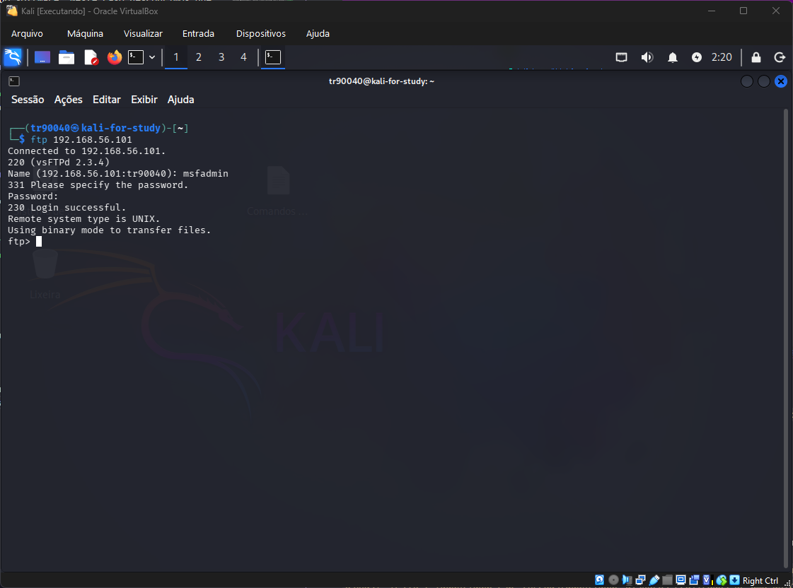

# Desafio-Dio-Ataque-FTP-DVWA-SMB
Esse repositório será documentada os processos executados para simular ataques de força bruta em FTP, automação de tentativas em formulário web (DVWA) e e password spraying em SMB com enumeração de usuários. 

## Tecnologias
- Virtual Box
- Kali Linux
- Metasploitable 2
- Nmap
- Medusa

## Criando ambiente de testes

### Instalação do Oracle Virtual Box

Instalação simples de realizar, sem nenhuma configuração diferente, basicamente apenas  `NEXT` até o `FINISH`

### Criação da máquina virtual com Kali Linux

Após baixarmos a imagem ISO do Kali Linux, criamos a máquina virtual, e a configuracao que devemos fazer, é deixar ela em rede interna`(host-only)`.

### Criação da máquina virtual com Metasploitable 2

A criacao da máquina virtual do Metasplotable nao utiliza ISO, na verdade após baixarmos o Metasploitable 2, já vem no formato de máquina virtual(vmdk), entao na criacao da máquina virtual, em `Specify virtual hard disk`, selecionamos a opcao para utilizar um disco rigido virtual existente.

Também precisamos configurar em rede interna`(host-only)`.

## Simulando ataque força bruta em FTP

### Descobrindo IP do alvo

Acessando Metasploitable 2, realizei o acesso utilizando login e password ->`msfadmin`, com isso realizei o comando no bash `ifconfig` para descobrir qual era o IP da máquina (192.168.56.101).

### Testando conexao se o IP é valido

Acessando o Kali Linux, podemos realizar o comando `ping -c {quantidade de disparos} {IP alvo}`, para testar conexao com a maquina virtual do Metasploitable 2, caso os pacotes sejam recebidos, entao a máquina está ativa e dentro da mesma rede.

### Nmap - Realizando varredura de portas, identificando quais servicos estao rodando e a versao do software

No terminal do Kali Linux, rodamos o comando `nmap -sV {ip alvo}`, ele irá retornar as portas que estao abertas, o servico e a versao do software. Neste caso descobrimos que a porta 21(FTP) está aberta.

### Criando arquivos de possiveis usuarios e senhas

No terminal do Kali Linux, rodamos o comandos `echo -e "{usuarios ou senhas}" > {arquivo.txt}`, no caso para quebrar linhas, pode ser utilizado `\n` no final de cada usuario ou senha.

### Medusa - Forcando acesso a porta 21(FTP) para descobrir qual usuario e senha 

Com os arquivos de possiveis usuarios e senhas criadas, podemos rodar o seguinte comando para testar os acessos:

`medusa -h {IP alvo} -U {arquivo que possui lista de usuarios} -P {arquivo que possui lista de senhas} -M ftp t {quantidades de threads(quantidade disparos realizados de uma única vez)} `

Conforme retorno do comando o usuario e senha que houve exito foi `msfadmin`.

### Acessando a porta 21(FTP)

Para acessar a porta 21(FTP), realizamos o comando `ftp {IP alvo}`, será solicitado o usuario e senha, e entao digitamos msfadmin para acessar.

Com isso estamos em acesso na porta 21, podemos importar e ou exportar arquivos por exemplo.
